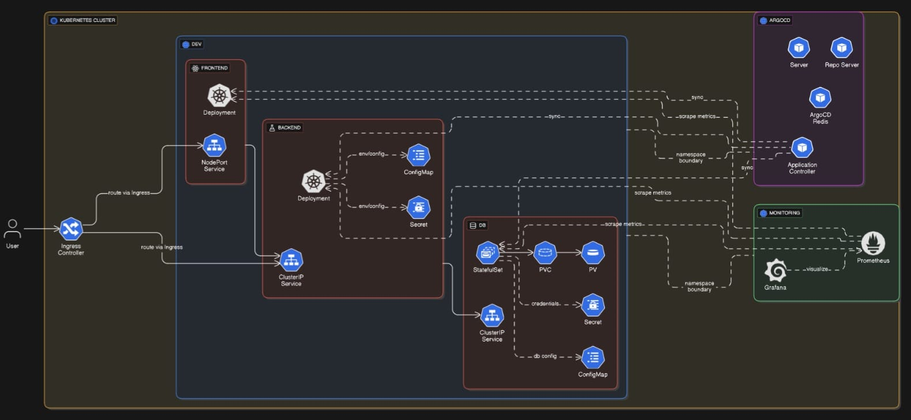

# 🚀 Kubernetes-Based CI/CD & GitOps Project

This project implements a **Cloud-Native CI/CD pipeline** with **GitOps** for deploying and monitoring applications in a **Kubernetes cluster**.  
It ensures **code quality**, **secure containerization**, **automated deployment**, and **observability** using modern DevOps tools.

---

## 🏗️ Architecture Overview

The project workflow is divided into two main stages: **Continuous Integration (CI)** and **Continuous Deployment (CD)**, following a **GitOps approach**.

.png)

---

## ⚙️ Continuous Integration (CI)

The CI process ensures code quality, security scanning, and containerization:

1. **GitHub Actions**  
   - Automates build and test pipelines on every code push.  
   - Ensures repeatable and reliable builds.  

2. **SonarCloud**  
   - Analyzes code for bugs, vulnerabilities, and code smells.  
   - Enforces quality gates before deployment.  

3. **Docker**  
   - Builds container images for backend and frontend.  
   - Provides portability and consistency.  

4. **Trivy**  
   - Scans container images for vulnerabilities.  
   - Ensures images are secure before publishing.  

5. **Docker Hub**  
   - Stores versioned Docker images.  
   - Serves as the image registry for Kubernetes.  

---

## 🚀 Continuous Deployment (CD)

Once the CI stage completes, deployment to Kubernetes is automated:

1. **ArgoCD**  
   - Continuously monitors GitHub for Kubernetes manifests.  
   - Syncs and applies changes to the cluster (GitOps).  

2. **Kubernetes Cluster**  
   - Hosts frontend, backend, and database pods.  
   - Provides scaling, load balancing, and resilience.  

3. **Prometheus**  
   - Collects application and cluster metrics.  
   - Scrapes metrics from frontend, backend, and DB pods.  

4. **Grafana**  
   - Visualizes metrics from Prometheus.  
   - Provides dashboards for monitoring application and infrastructure health.  

---

## 🔄 GitOps Approach

- All application manifests (YAML files) are stored in **GitHub**.  
- **ArgoCD** watches the repository for changes.  
- Any update to manifests is automatically applied to the cluster.  
- Ensures a **single source of truth** for deployments.  

---

## 🗂️ Kubernetes Application Architecture

The system is deployed in a **Kubernetes cluster** with the following components:

### 🔹 Ingress Layer
- **Ingress Controller**  
  - Acts as the entry point for external users.  
  - Routes requests to frontend or backend services.  

---

### 🔹 Application Layer
- **Frontend**  
  - Deployed as a **Deployment**.  
  - Exposed via **NodePort Service**.  
  - Receives external traffic through the Ingress Controller.  

- **Backend**  
  - Deployed as a **Deployment**.  
  - Exposed internally via **ClusterIP Service**.  
  - Uses **ConfigMaps** for non-sensitive configs.  
  - Uses **Secrets** for sensitive environment variables.  

- **Database (DB)**  
  - Deployed as a **StatefulSet** to maintain stable network IDs and persistent storage.  
  - Data stored in **PersistentVolume (PV)** via **PersistentVolumeClaim (PVC)**.  
  - Secured with **Secrets** (credentials) and **ConfigMaps** (DB configs).  
  - Exposed internally via a **ClusterIP Service**.  

---

### 🔹 GitOps Layer
- **ArgoCD Components**  
  - **Server**: Web UI and API.  
  - **Repo Server**: Manages Git repository connections.  
  - **Application Controller**: Applies manifests to the cluster.  
  - **Redis**: Stores ArgoCD state.  

- **Function**: Continuously syncs GitHub repo → applies changes to cluster automatically.  

---

### 🔹 Monitoring Layer
- **Prometheus**  
  - Scrapes metrics from frontend, backend, and DB pods.  
  - Monitors resource usage and application performance.  

- **Grafana**  
  - Connects to Prometheus.  
  - Provides dashboards for system and application observability.  

---

## 🛠️ Technology Stack

- **CI/CD**: GitHub Actions, Docker, Trivy, SonarCloud  
- **GitOps**: ArgoCD  
- **Orchestration**: Kubernetes  
- **Monitoring**: Prometheus & Grafana  
- **Storage**: PVC & PV for databases  
- **Networking**: Ingress Controller, NodePort, ClusterIP  

---

## 🚦 How It Works

1. Developer pushes code to GitHub.  
2. GitHub Actions pipeline triggers → runs SonarCloud checks, builds Docker images, runs Trivy scans.  
3. Secure images pushed to Docker Hub.  
4. ArgoCD detects new manifests in GitHub repo → deploys them to Kubernetes.  
5. Frontend accessible via Ingress → communicates with Backend and DB.  
6. Prometheus scrapes metrics → Grafana visualizes dashboards.  

---

## 📌 Future Improvements

- 🔔 Integrate **Alertmanager** with Prometheus for proactive alerts.  
- 📈 Enable **Horizontal Pod Autoscaling (HPA)** for frontend and backend.  
- 🔐 Apply **OPA/Gatekeeper** for Kubernetes security policies.  
- 🌐 Add **service mesh (Istio/Linkerd)** for advanced observability and traffic management.  

---
